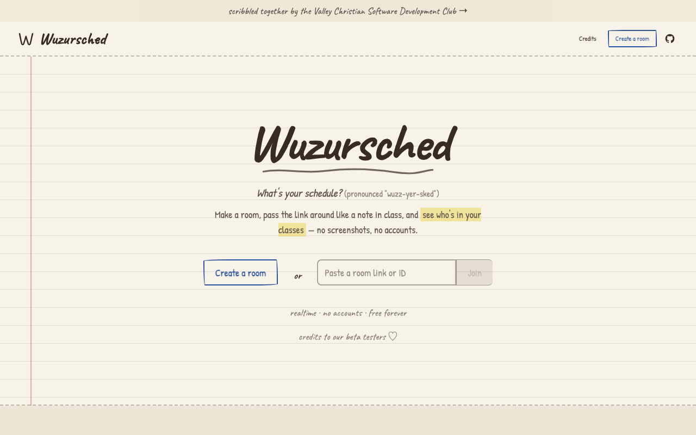
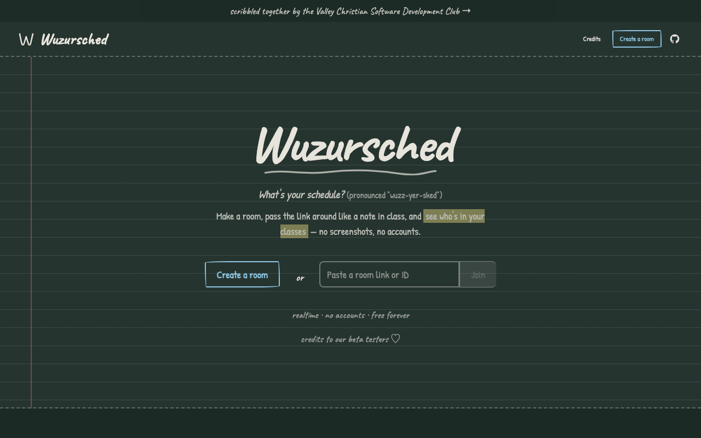

<div align="center">


# Wuzursched

**What's your schedule?**

Share your class schedule and compare it with friends — in realtime, with no accounts.

[](https://github.com/ThatXliner/wuzursched/actions/workflows/ci.yml)
[](./LICENSE)
[](https://svelte.dev/docs/kit)
[](https://supabase.com)

</div>

---

Wuzursched (pronounced [`/wʌzjɜskɛd/`](http://ipa-reader.xyz/?text=wʌzjɜskɛd), "wuzz-yer-sked") kills the yearly ritual of screenshotting your schedule and squinting at everyone else's. Make a room, share the link, and instantly see which classes you have with which friends.

The whole site is designed to feel like the paper planner it replaces: ruled notebook paper, handwritten headings, sticky notes, and tape — with a chalkboard theme in dark mode.

## 📸 Screenshots

|                                            📓 Paper (light)                                            |                                     🧑‍🏫 Chalkboard (dark)                                     |
| :----------------------------------------------------------------------------------------------------: | :------------------------------------------------------------------------------------------: |
|  |  |

More in the [screenshot gallery](./docs/SCREENSHOTS.md).

## ✨ Features

- **🔗 Rooms are just links** — create a room in one click and share the URL. No sign-up, no email, no app.
- **⚡ Realtime everything** — schedules and classes appear the moment someone submits them, powered by Supabase Realtime.
- **🎯 Shared classes, highlighted** — every schedule in the room is compared against yours, and classes you have together light up.
- **🔍 Search & filter** — fuzzy-search students by name, or filter the room down to only schedules that overlap with yours.
- **🌗 Chalkboard mode** — dark mode swaps the paper for a dusty chalkboard, following your system preference automatically.
- **🧠 Remembers you** — your identity per room is stored locally, so you only enter your schedule once.

## 🏫 How it works

1. **Create a room.** You get a unique URL backed by a fresh room in the database.
2. **Enter your schedule.** Pick (or add) your classes for each period — A day and B day, four periods each.
3. **Share the link.** As friends fill in their schedules, they show up live, with your shared classes highlighted.

> [!NOTE]
> Wuzursched currently assumes an A/B block schedule with 4 periods per day. Good/strict class normalization (merging "AP Calc BC" and "Calculus BC") is a long-term goal.

## 🛠️ Tech stack

| Layer     | Tech                                                                                                            |
| --------- | --------------------------------------------------------------------------------------------------------------- |
| Framework | [SvelteKit](https://svelte.dev/docs/kit) (Svelte 5 runes)                                                       |
| Styling   | [Tailwind CSS v4](https://tailwindcss.com) + [daisyUI v5](https://daisyui.com) + [bits-ui](https://bits-ui.com) |
| Backend   | [Supabase](https://supabase.com) (Postgres, Realtime, RLS)                                                      |
| Search    | [Fuse.js](https://fusejs.io) fuzzy search                                                                       |
| Testing   | [Playwright](https://playwright.dev)                                                                            |
| Hosting   | [Vercel](https://vercel.com)                                                                                    |

## 🚀 Development

You'll need [pnpm](https://pnpm.io), [Node.js](https://nodejs.org) 22+, and the [Supabase CLI](https://supabase.com/docs/guides/cli) (which needs Docker).

```bash
# 1. Clone the repo
git clone https://github.com/ThatXliner/wuzursched
cd wuzursched

# 2. Install dependencies
pnpm install

# 3. Start a local Supabase stack and apply migrations + seed data
supabase start
supabase db reset

# 4. Generate a .env with the local Supabase credentials
supabase status --output env | node convert_env.js > .env

# 5. Run the dev server
pnpm run dev
```

### Useful scripts

| Command                       | What it does                                      |
| ----------------------------- | ------------------------------------------------- |
| `pnpm run dev`                | Start the dev server                              |
| `pnpm run build`              | Production build                                  |
| `pnpm run preview`            | Preview the production build                      |
| `pnpm test`                   | Run Playwright end-to-end tests                   |
| `pnpm run check`              | Type-check with `svelte-check`                    |
| `pnpm run lint`               | Check formatting (Prettier) and lint (ESLint)     |
| `pnpm run format`             | Auto-format the codebase                          |
| `pnpm run update-types:local` | Regenerate Supabase types from the local database |

### Project layout

```
src/
├── lib/                  # Shared components & utilities
│   ├── InfoInput.svelte  #   Schedule entry form
│   ├── ClassPicker.svelte#   Searchable class dropdown
│   ├── Realtime.svelte   #   Realtime connection indicator
│   └── supabase.d.ts     #   Generated database types (don't edit by hand)
├── routes/
│   ├── +page.svelte      # Landing page
│   ├── create/           # Room creation endpoint
│   └── room/[room=uuid]/ # The room: view, search, and compare schedules
supabase/
├── migrations/           # Database schema
└── seed.sql              # Local seed data
```

## 🤝 Contributing

Issues and pull requests are welcome! CI runs Playwright tests against a real local Supabase stack and verifies that the committed database types match the schema, so please run `pnpm run check` and `pnpm run lint` before opening a PR.

## 📜 License

Copyright © 2023 [ThatXliner](https://github.com/ThatXliner). Licensed under the [GNU AGPLv3](./LICENSE).

<div align="center">
<sub>Built with 💜 by the <a href="https://vcsdclub.org">Valley Christian Software Development Club</a></sub>
</div>
