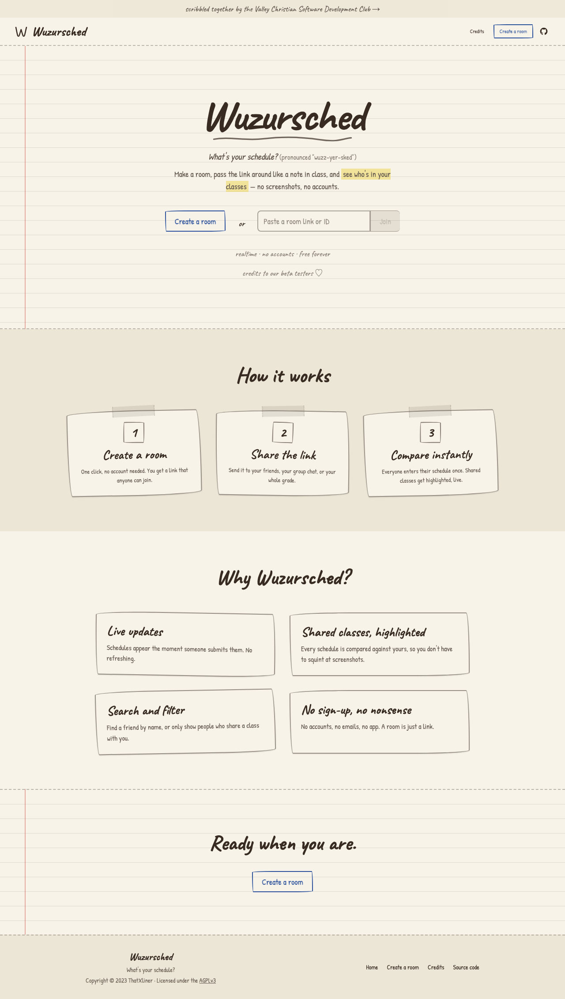
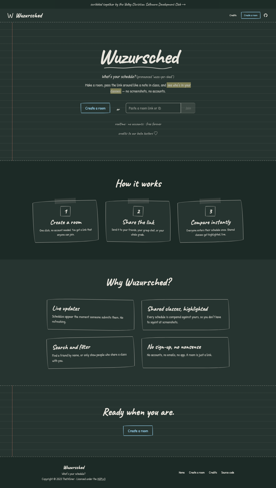
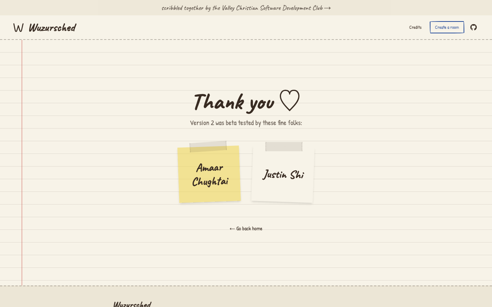
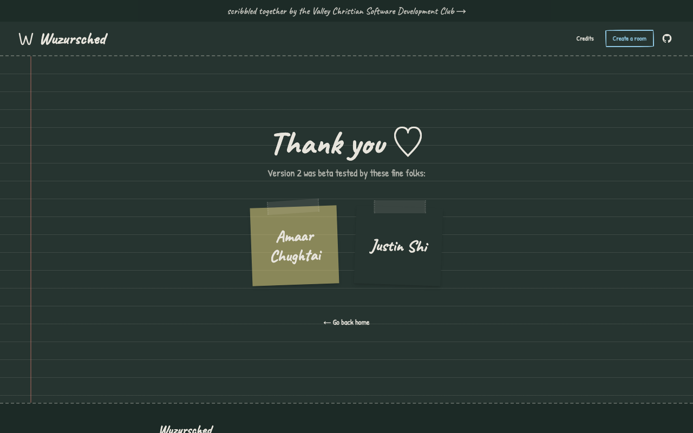

# Screenshot gallery

Wuzursched is designed to feel like the paper planner it replaces. Light mode is
ruled notebook paper ("paper"); dark mode is a dusty chalkboard ("chalkboard").
The theme follows your system preference.

## Landing page

### Paper (light)

### Chalkboard (dark)

## Credits

### Paper (light)

### Chalkboard (dark)

